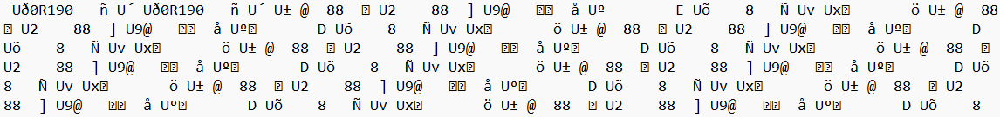

It's not a great feeling to walk out to your car in the morning and find that your windshield is completely covered in ice. Scraping it off is a pain, and it's even worse when you're in a hurry.

I used to drive a 20-year-old Honda Accord. It had a barebones climate control system, with buttons to choose where the air would blow, and dials to choose the temperature and fan speed. It was simple, but it worked. If I set the mode to defrost and then turned off the car, the defroster would still be on when I started the car again.

Not so in newer cars. My current car, a 5th generation Toyota RAV4, won't keep the front or rear defrosters on after restarting the car. I installed a remote start system, but without being able to keep the defroster on, it's not very useful. I could just as easily start the car myself and then turn on the defroster, but that would require me to go outside earlier than I want to.

I've been told this is a safety feature (and common on many newer cars, not just my Toyota). However, according to [Toyota's website](https://support.toyota.com/s/article/Can-I-control-the-AC-10212?language=en_US), when you remote start the car, "if the outside temperature is less than 41°F, the front and rear defrosters will turn on." Ah, so you _can_ remotely defrost the windshield—if you bought a trim level that comes with Toyota's remote start subscription service. I didn't.

So I've been thinking about how I could hack my car's climate control system to keep the defroster on after restarting the car.

### The CAN Bus

With almost everything in modern cars being computer-controlled, CAN is the most common way to communicate between different systems. The CAN bus is a serial bus that uses a twisted pair of wires to carry data. It's a multi-master bus, meaning that multiple devices can be connected to the bus and transmit data at the same time. Each device has a unique ID, and the bus uses arbitration to determine which device gets to transmit data at any given time.

CAN hacking is not new. There are many tools and a plethora of documentation and tutorials available for sniffing, intercepting, and modifying CAN traffic. [Comma.ai](https://comma.ai/), which I use every day, uses a CAN interceptor to modify communications between the car's lane keeping camera and the car's computer to send commands to drive the car semi-autonomously.

I figured that if CAN messages could _drive the car_, then they could probably control the climate control system, too. I started by connecting my computer to the [panda](https://comma.ai/shop/panda) that I'd installed already for openpilot and opening [cabana](https://cabana.comma.ai/) to view the raw CAN traffic. Unfortunately, nothing changed when I messed with the climate control buttons. Cars have multiple CAN buses, so I tried sniffing other buses, including the one connected to the remote starter and the one on the back of the radio. Still nothing.

Simply put, CAN is not used for controlling the climate system in my car. And if there's no CAN traffic, there's nothing to sniff. I needed to find another way to control the climate system.

(Actually, there might be a way to control it through CAN. Newer Highlanders and Venzas with the 12-inch screen can control the climate system through the touchscreen, and some RAV4 Prime and Prius Prime models can control it through the app. If you have one of those, you're welcome to try sniffing the CAN traffic and see if you can figure out how to control the climate system. I'd love to hear about it.)

### The LIN Bus

I started looking for other ways to control the climate system. Studying the wiring diagrams for my car, I found that the control panel on the dash is connected to the climate control unit through a LIN bus. (I also found that there was a CAN line connected to the control unit directly to a CAN gateway, but I'd have to rip apart most of my car's dash to get to it.)

LIN is a serial bus that uses a single wire to carry data. It is different from CAN in that it is a single-master bus, meaning that only one device can transmit data at a time. The master node sends data to up to 16 slave nodes, and the slave devices can respond to requests sent by the master. [More information about LIN can be found here](https://www.csselectronics.com/pages/lin-bus-protocol-intro-basics).

Because LIN is much newer than CAN, well-documented hardware is scarce and open-source utilities for sniffing and intercepting traffic are practically nonexistent. I decided to start by reverse engineering the LIN data transmitted between the control panel and the climate control unit. This was a lot easier than I expected. A [LIN bus transciever with a TJA1020 chip](https://www.amazon.com/dp/B0895WQ5VM) converts LIN data to TTL serial data, which can be read by a [USB-to-UART adapter](https://www.amazon.com/dp/B00LODGRV8. I ordered one and connected it to my computer, with the LIN terminal connected to the bus alongside both the car and the panel.

Opening a serial connection using PuTTY gave me this:


Looks ugly, but there's a pattern. A hex editor was a bit more useful. This sequence of bytes was repeated over and over:
```
55 B1 00 40 00 00 38 38 00 00 9D 00 55 32 00 00 00 00 38 38 00 00 5D 00 55 39 40 00 00 00 10 90 00 00 E5 00 55 BA 00 00 00 00 00 00 00 00 45 00 55 F5 00 00 00 00 38 00 00 00 D1 00 55 76 00 55 78 90 00 00 00 00 00 00 00 F6 00
```

A LIN frame begins with a sync byte, followed by a 6-bit ID, a 2-bit parity bit, and then 8 data bytes. The transciever returns `0x55` to represent the sync byte and `0x00` at the end of the frame. Separating the frames gives us this:
```
55 B1 00 40 00 00 38 38 00 00 9D 00
55 32 00 00 00 00 38 38 00 00 5D 00
55 39 40 00 00 00 10 90 00 00 E5 00
55 BA 00 00 00 00 00 00 00 00 45 00
55 F5 00 00 00 00 38 00 00 00 D1 00
55 76 00
55 78 90 00 00 00 00 00 00 00 F6 00
```

Disconnecting the control panel from the bus changed the output:
```
55 B1 00 40 00 00 38 38 00 00 9D 00
55 32 00 00 00 00 38 38 00 00 5D 00
55 39 00
55 BA 00
55 F5 00 00 00 00 38 00 00 00 D1 00
55 76 00
55 78 00
```

### Deciphering the Data

Immediately we can determine that `0xB1`, `0x32`, and `0xF5` are frames of data sent by the master node (the climate control unit) to the slave node (the control panel). `0x39`, `0xBA`, and `0x78` are requests, which are responded to by the control panel. I have no clue what `0x76` is. To figure out which frames do what, I simply pressed buttons and observed the changes in the data.

#### Status

Frames with the ID `0xB1` contain the current status of the climate system.

| Function        | frame                                                | Bits (after   removing checksum) |
|-----------------|------------------------------------------------------|----------------------------------|
| power (fan bit) | off `80 00 22 00 38 38 00 80 ba`                     | >>   0x30 & 7                    |
|                 | on  `80 23 13 00 2c 2c 00 81 bd`                     |                                  |
| auto            | off <code>80 03 13 00 2c 2c 00 81 dd</code>          | >> 0x35 & 1                      |
|                 | on  <code>80 23 13 00 2c 2c 00 81 bd</code>          |                                  |
| fan             | 1. <code>80 01 13 00 2c 2c 00 81 df</code>           | >> 0x30 & 7                      |
|                 | 2. <code>80 02 13 00 2c 2c 00 81 de</code>           |                                  |
|                 | 3. <code>80 03 13 00 2c 2c 00 81 dd</code>           |                                  |
|                 | 4. <code>80 04 13 00 2c 2c 00 81 dc</code>           |                                  |
|                 | 5. <code>80 05 13 00 2c 2c 00 81 db</code>           |                                  |
|                 | 6. <code>80 06 13 00 2c 2c 00 81 da</code>           |                                  |
|                 | 7. <code>80 07 13 00 2c 2c 00 81 d9</code>           |                                  |
| front defrost?? | off   <code>80 03 13 00 2c 2c 00 81 dd</code>        |                                  |
|                 | on  <code>80 03 13 00 2c 2c 00 81 dd</code>          |                                  |
| rear defrost    | off   <code>80 03 13 00 2c 2c 00 81 dd</code>        | >> 0x26 & 1                      |
|                 | on  <code>80 03 13 40 2c 2c 00 81 9d</code>          |                                  |
| eco             | off   <code>80 03 13 00 2c 2c 00 81 dd</code>        | >> 0x3b & 1                      |
|                 | on  <code>88 03 13 00 2c 2c 00 81 d5</code>          |                                  |
| mode            | face         <code>80 02 11 00 2c 2c 00 81 e0</code> | >> 0x28 & 7                      |
|                 | both         <code>80 02 12 00 2c 2c 00 81 df</code> |                                  |
|                 | feet         <code>80 02 13 00 2c 2c 00 81 de</code> |                                  |
|                 | feet/defrost <code>80 02 14 00 2c 2c 00 81 dd</code> |                                  |
| recycle         | off   <code>80 02 12 00 2c 2c 00 81 df</code>        |                                  |
|                 | on  <code>80 02 22 00 2c 2c 00 81 cf</code>          |                                  |
| s-mode          | off   <code>00 02 12 00 2c 2c 00 81 60</code>        |                                  |
|                 | on  <code>80 02 12 00 2c 2c 00 81 df</code>          |                                  |
| sync            | off   <code>00 02 12 00 2c 2c 00 81 60</code>        |                                  |
|                 | on  <code>00 02 12 20 2c 2c 00 81 40</code>          |                                  |
| a/c             | off   <code>00 02 12 00 2c 2c 00 80 61</code>        |                                  |
|                 | on  <code>00 02 12 00 2c 2c 00 81 60</code>          |                                  |
| illumination    | off   <code>00 06 14 00 35 36 00 81 47</code>        |                                  |
|                 | on  <code>00 06 14 00 35 36 00 c1 07</code>          |                                  |

#### Button Presses

Pressing buttons on the control panel to change the temperature, fan speed, or blower mode causes a change in the response to `0x39`. Its data with nothing pressed is
`40 00 00 00 10 90 00 00 e5`. When a button is pressed, a bit or bits in the response change for a minimum of one frame before returning to the response. If the button is held down, the response continues to reflect the pressed button until it is released.

For the most part, multiple buttons can be pressed simultaneously. There are two exceptions.

1. If the fan up/down buttons are pressed simultaneously, the panel will send the response for the fan up button and the fan speed will increase.
2. Temperature up/down can be triggered multiple times per command. For example, if I quickly spin the driver temperature knob clockwise, the panel will respond to the next `0x39` request with <code>40 00 00 00 <strong>12</strong> 90 00 00</code> or <code>40 00 00 00 <strong>13</strong> 90 00 00</code>. The temperature will increase by 2 or 3 degrees, respectively.

| Button              | Data (8 bytes + checksum)                                         | Operation                                                    |
|---------------------|-------------------------------------------------------------------|--------------------------------------------------------------|
| none                | <code>40 00 00 00 10 90 00 00 <em>e5</em></code>                  |                                                              |
| off                 | <code>4<strong>2</strong> 00 00 00 10 90 00 00 <em>e3</em></code> | <code>&#124; 0<strong>2</strong> 00 00 00 00 00 00 00</code> |
| auto                | <code>4<strong>8</strong> 00 00 00 10 90 00 00 <em>dd</em></code> | <code>&#124; 0<strong>8</strong> 00 00 00 00 00 00 00</code> |
| driver temp down    | <code>40 00 00 00 <strong>0f</strong> 90 00 00 <em>e6</em></code> | <code>- 00 00 00 00 0<strong>1</strong> 00 00 00</code>      |
| driver temp up      | <code>40 00 00 00 <strong>11</strong> 90 00 00 <em>e4</em></code> | <code>+ 00 00 00 00 0<strong>1</strong> 00 00 00</code>      |
| passenger temp down | <code>40 00 00 00 10 <strong>8f</strong> 00 00 <em>e6</em></code> | <code>- 00 00 00 00 00 0<strong>1</strong> 00 00</code>      |
| passenger temp up   | <code>40 00 00 00 10 <strong>91</strong> 00 00 <em>e6</em></code> | <code>+ 00 00 00 00 00 0<strong>1</strong> 00 00</code>      |
| sync                | <code>40 00 00 <strong>2</strong>0 10 90 00 00 <em>c5</em></code> | <code>&#124; 00 00 00 <strong>2</strong>0 00 00 00 00</code> |
| a/c                 | <code>40 <strong>8</strong>0 00 00 10 90 00 00 <em>65</em></code> | <code>&#124; 00 <strong>8</strong>0 00 00 00 00 00 00</code> |
| front defrost       | <code>40 00 00 <strong>8</strong>0 10 90 00 00 <em>65</em></code> | <code>&#124; 00 00 00 <strong>8</strong>0 00 00 00 00</code> |
| rear defrost        | <code>40 00 00 <strong>4</strong>0 10 90 00 00 <em>a5</em></code> | <code>&#124; 00 00 00 <strong>4</strong>0 00 00 00 00</code> |
| eco                 | <code>40 <strong>4</strong>0 00 00 10 90 00 00 <em>a5</em></code> | <code>&#124; 00 <strong>4</strong>0 00 00 00 00 00 00</code> |
| fan down            | <code>40 <strong>3d</strong> 00 00 10 90 00 00 <em>a8</em></code> | <code>&#124; 00 <strong>3d</strong> 00 00 00 00 00 00</code> |
| fan up              | <code>40 <strong>3c</strong> 00 00 10 90 00 00 <em>a9</em></code> | <code>&#124; 00 <strong>3c</strong> 00 00 00 00 00 00</code> |
| mode                | <code>40 00 <strong>1c</strong> 00 10 90 00 00 <em>c9</em></code> | <code>&#124; 00 <strong>1c</strong> 00 00 00 00 00 00</code> |
| recycle air         | <code>40 00 00 00 10 90 <strong>c</strong>0 00 <em>25</em></code> | <code>&#124; 00 00 00 00 00 00 <strong>c</strong>0 00</code> |
| s-mode              | <code>40 00 <strong>8</strong>0 00 10 90 00 00 <em>65</em></code> | <code>&#124; 00 <strong>8</strong>0 00 00 00 00 00 00</code> |


#### Status Messages
